# Video Visual Explanations

This is a PyTorch demo implemented several visualization methods for video classification networks. The target is to provide a toolkit (as [TorchRay](https://github.com/facebookresearch/TorchRay) to image) to interprete commonly utilized video classfication networks, such as I3D, R(2+1)D, TSM et al., which is also called *attribution* task, namely the problem of determining which part of the input video is responsible for the value computed by a neural network.

The current version supports attribution methods and video classification models as following:

#### Video classification models:
* **Pretrained on Kinetics-400**: I3D, R(2+1)D, R3D, MC3, TSM;
* **Pretrained on EPIC-Kitchens** (noun & verb): TSM.

#### Attribution methods:
* **Backprop-based**: Gradients, Gradients x Inputs, Integrated Gradients;
* **Activation-based**: GradCAM (does not support TSM now);
* **Perturbation-based**: 
  * **2D-EP**: An extended version of Entremal Perturbations on the video input that perturbs each frame separately and regularizes the perturbation area in each frame to the target ratio equally.
  * **3D-EP**: An extended version of Entremal Perturbations on the video input that perturbs across all frames and regularizes the whole perturbation area in all frames to the target ratio.
  * **STEP**: Spatio-Temporal Extremal Perturbations with a special regularization term for the spatiotemporal smoothness in the video attribution results.

## Requirements

* Python 3.6.5 or greater
* PyTorch 1.2.0 or greater
* matplotlib==2.2.3
* numpy==1.14.3
* opencv_python==4.1.2.30
* torchvision==0.4.0a0
* torchray==1.0.0.2
* tqdm==4.45.0
* pandas==0.23.3
* scikit_image==0.15.0
* Pillow==7.1.2
* scikit_learn==0.22.2.post1

## Running the code

* **Inputs frames**: Testing frames are provided in the directory ./test_data/$dataset_name$/sampled_frames
* **Outputs**: The results will be defaultly saved to the directory ./visual_res/$vis_method$/$model$/$save_label$/.

### Arguments
* **videos_dir**: Directory for video frames. Frames belonging to one video should be put in one file under the directory, and the first part splited by '-' will be considered as label name.
* **model**: Name of test model. Default is R(2+1)D, choices include R(2+1)D, R3D, MC3, I3D and TSM currently.
* **pretrain_dataset**: Dataset name that test model pretrained on. Choices include 'kinetics', 'epic-kitchens-verb', 'epic-kitchens-noun'.
* **vis_method**: Name of visualization methods. Choices include 'grad', 'grad*input', 'integrated_grad', 'grad_cam', '2d_ep', '3d_ep', 'step'. 
* **save_label**: Extra label for saving results. If given, visualization results will be saved in ./visual_res/$vis_method$/$model$/$save_label$.
* **no_gpu**: If set, the demo will be run on CPU, else run on only one GPU.

Arguments for perturb:
* **num_iter**: Number of iterations to get the perturbation results. Default is set to 2000 for better convergence.
* **perturb_area**: Target area for preserving parts on input. Default is 0.1 (10% of all). Choices include [0.01, 0.02, 0.05, 0.1, 0.15, 0.2].

Arguments for gradient methods:
* **polarity**: The polarity of showing gradients. Default is 'positive', which means the negative gradients will be set as 0 before visualization.

### Examples

#### Saptiotemporal Perturbation + R(2+1)D (pretrained on Kinetics-400)
`$ python main.py --videos_dir VideoVisual/test_data/kinetics/sampled_frames --model r2plus1d --pretrain_dataset kinetics --vis_method step --num_iter 2000 --perturb_area 0.1`

#### Spatiotemporal Perturbation + TSM (pretrained on EPIC-Kitchens-noun)
`$ python main.py --videos_dir VideoVisual/test_data/epic-kitchens-noun/sampled_frames --model tsm --pretrain_dataset epic-kitchens-noun --vis_method perturb --num_iter 2000 --perturb_area 0.05`

#### Integrated Gradients + I3D (pretrained on Kinetics-400)
`$ python main.py --videos_dir VideoVisual/test_data/kinetics/sampled_frames --model i3d --pretrain_dataset kinetics --vis_method integrated_grad`


## Results

### Kinectis-400 (GT = ironing)
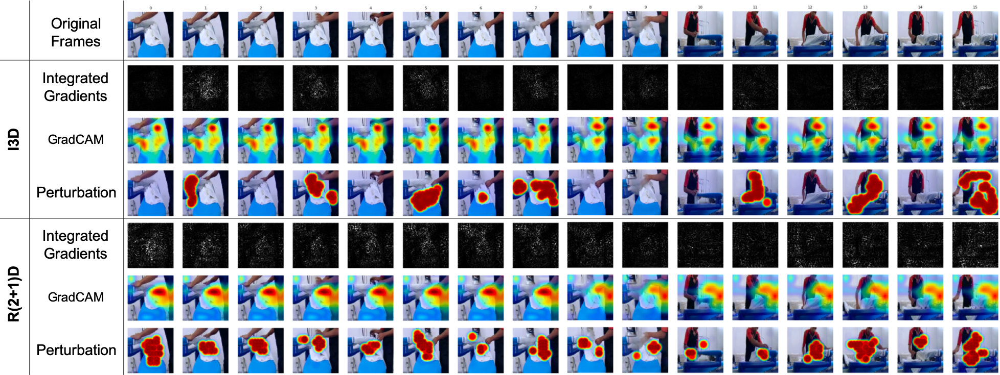
'Perturbation' denotes 3D-EP here.
### EPIC-Kitchens-Noun (GT = cupboard)
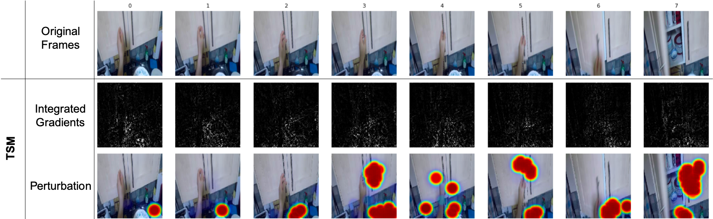
'Perturbation' denotes 3D-EP here.

### GIF visualization of perturbation results (on UCF101 dataset by STEP)
<!-- #### Long Jump
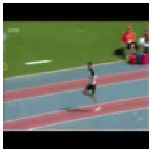 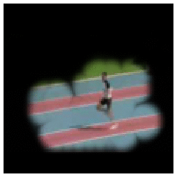
#### Walking With Dog
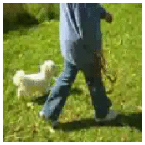 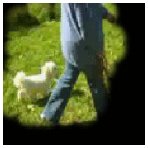 -->

| <div style="width:100px">Basketball 5%</div> | <div style="width:100px">Skijet 5%</div> | <div style="width:100px">Walking-With-Dog 10%</div> | <div style="width:100px">Fencing 10%</div> | <div style="width:100px">OpenFridge 10%</div> | <div style="width:100px">CloseDrawer 10%</div> | <div style="width:100px">OpenCupboard 15%</div> |
| ------------- | ------------- | ------------- | ------------- | ------------- | ------------- | ------------- |
| 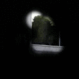 |  |  | 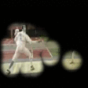 | 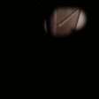 | 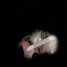 | 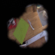 |
<!-- 
| Basketball 5% | Skijet 5% | Walking-With-Dog 10% | Fencing 10% | OpenFridge 10% | CloseDrawer 10% | OpenCupboard 15% |
| ------------- | ------------- | ------------- | ------------- | ------------- | ------------- | ------------- |
|  |  |  |  |  |  |  | -->

## Reference

### Ours preprint (to appear in WACV2021):
```
@article{li2020comprehensive,
  title={Towards Visually Explaining Video Understanding Networks with Perturbation},
  author={Li, Zhenqiang and Wang, Weimin and Li, Zuoyue and Huang, Yifei and Sato, Yoichi},
  journal={arXiv preprint arXiv:2005.00375},
  year={2020}
}
```

### Intergated Gradients:
```
@inproceedings{sundararajan2017axiomatic,
  title={Axiomatic attribution for deep networks},
  author={Sundararajan, Mukund and Taly, Ankur and Yan, Qiqi},
  booktitle={ICML},
  year={2017},
}
```

### GradCAM:
```
@inproceedings{selvaraju2017grad,
  title={Grad-cam: Visual explanations from deep networks via gradient-based localization},
  author={Selvaraju, Ramprasaath R and Cogswell, Michael and Das, Abhishek and Vedantam, Ramakrishna and Parikh, Devi and Batra, Dhruv},
  booktitle={ICCV},
  year={2017}
}
```

### Extremal Perturbation:
```
@inproceedings{fong2019understanding,
  title={Understanding deep networks via extremal perturbations and smooth masks},
  author={Fong, Ruth and Patrick, Mandela and Vedaldi, Andrea},
  booktitle={ICCV},
  year={2019}
}
```
